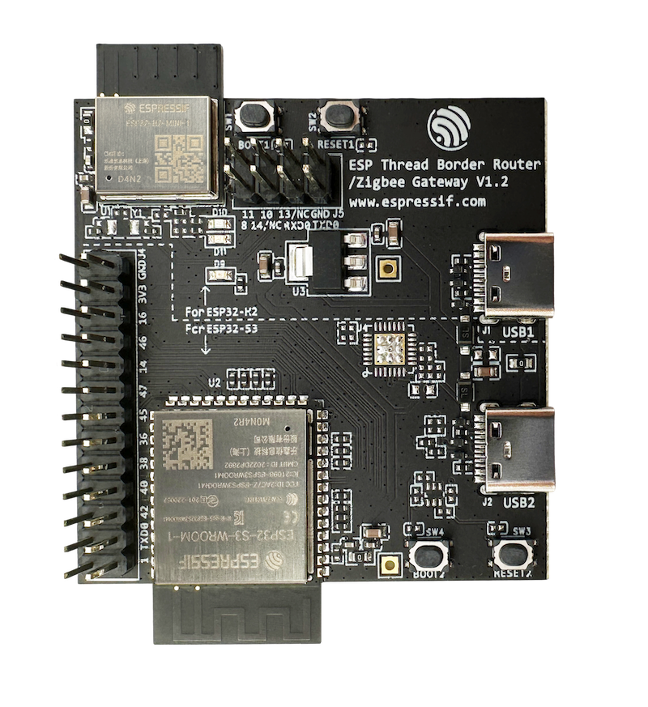

| Supported Targets | ESP32 | ESP32-S2 | ESP32-S3 | ESP32-C3 |
| ----------------- | ----- | -------- | -------- | -------- |

# Gateway Example

This example demonstrates how to build a Zigbee Gateway device. It runs on a Wi-Fi SoC such as ESP32, ESP32-C3 and ESP32-S3, with an 802.15.4 SoC like ESP32-H2 running [esp_zigbee_rcp](../esp_zigbee_rcp) to provide 802.15.4 radio.

## Hardware Required

* One development board with ESP32 or ESP32-S3 SoC acting as Zigbee gateway (loaded with esp_zigbee_gateway example)
* A USB cable for power supply and programming
* Five jumper wires for UART (TX, RX, RST, BOOT and GND)
* Gateway doesn't function alone. Choose ESP32-H2 as Zigbee rcp (see [esp_zigbee_rcp example](../esp_zigbee_rcp))
* **Flash** Zigbee rcp on the ESP32-H2 DevKitC first **before** connecting to Zigbee gateway, if auto rcp update feature is disable.
* Connect the two SoCs via UART, below is an example setup with ESP32-DevKitC and ESP32-H2-DevKitC:

## Configure the project

Before project configuration and build, make sure to set the correct chip target using `idf.py set-target` command.

### Standalone Modules

The SDK supports manually connecting an ESP32-H2 RCP to an ESP32 series Wi-Fi SoC. Extra two jumper wires needed for RESET (RST) and BOOT based on the picture above. As one way of connection is following:

ESP32 pin     | ESP32-H2 pin
------------- |-------------
   GND        |    G
   GPIO4 (RX) |    TX
   GPIO5 (TX) |    RX
   GPI017     |    RST
   GPIO18     |    GPIO9(BOOT)

TX, RX, RST and BOOT pin from ESP32 side can be configured by user in `idf.py menuconfig` under menu "ESP Zigbee gateway rcp update".

Other pin number is also available for user to configure if needed.

### ESP Thread Border Router Board

The ESP Thread border router board provides an integrated module of an ESP32-S3 SoC and an ESP32-H2 RCP.

The two SoCs are connected with following interfaces:
* UART and SPI for serial communication
* RESET and BOOT pins for RCP Update
* 3-Wires PTA for RF coexistence

No jumper wires needed. No `idf.py menuconfig` under menu "ESP Zigbee gateway rcp update" configure to change.

## Erase the NVRAM 

Before flash it to the board, it is recommended to erase NVRAM if user doesn't want to keep the previous examples or other projects stored info 
using `idf.py -p PORT erase-flash`

## Create the RCP firmware image

The esp_zigbee_gateway supports updating the RCP image. Generate rcp image before building the esp_zigbee_gateway example.

Build the [esp_zigbee_rcp](../esp_zigbee_rcp) example. Later in the esp_zigbee_gateway building process, the built RCP image will be automatically packed into the esp_zigbee_gateway firmware. See detail in [CMakeLists.txt](main/CMakeLists.txt).

## Build and Flash

Build the project, flash it to the board, and start the monitor tool to view the serial output by running `idf.py -p PORT flash monitor`

(To exit the serial monitor, type ``Ctrl-]``.)

## Example Output

As you run the example, you will see the following log:

esp_zigbee_gateway:  
I (660) ESP_ZB_GATEWAY: status: -1  
I (670) ESP_ZB_GATEWAY: Zigbee stack initialized  
I (680) ESP_ZB_GATEWAY: Zigbee rcp device booted  
I (1280) ESP_ZB_GATEWAY: Start network formation  
I (3060) ESP_ZB_GATEWAY: Formed network successfully (ieee extended address: f9:54:2d:01:a0:03:f7:84, PAN ID: 0x8651)  
I (4060) ESP_ZB_GATEWAY: status: 0  
I (4400) ESP_ZB_GATEWAY: Network steering started  

## Gateway Functions

 * The built esp_zigbee_gateway image will contain an updatable RCP image and can automatically update the RCP on version mismatch or RCP failure.
 * After Zigbee gateway starts up, it will read MAC ieee address and Zigbee stack version string from the Zigbee rcp and start working together with Zigbee rcp via UART communication to form a Zigbee network
 * More Gateway functionalities supporting Wi-Fi interaction will come later

## Troubleshooting

For any technical queries, please open an [issue](https://github.com/espressif/esp-zigbee-sdk/issues) on GitHub. We will get back to you soon
