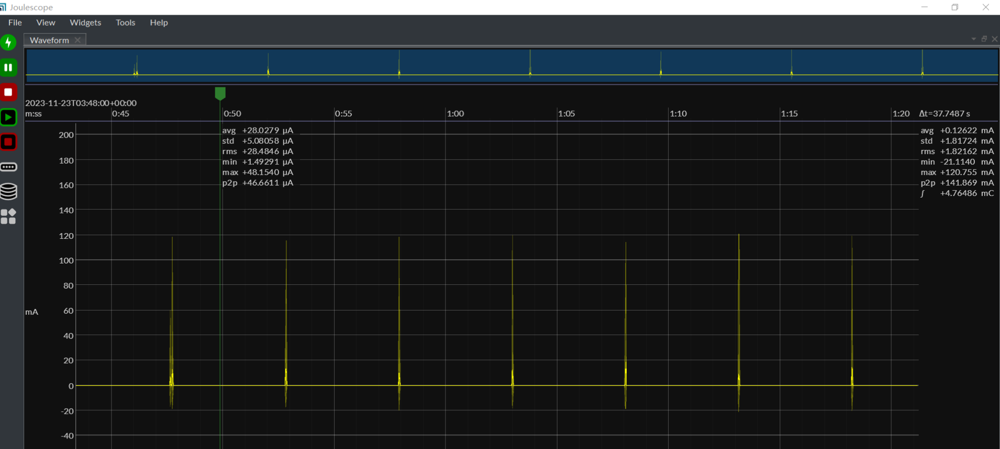

| Supported Targets | ESP32-H2 | ESP32-C6 |
| ----------------- | -------- | -------- |

# Sleepy End Device Example 

This test code shows how to configure Zigbee sleepy end device.

## Hardware Required

* One development board with ESP32-H2 SoC acting as Zigbee end-device (loaded with sleepy_end_device example)
* A USB cable for power supply and programming
* Choose another ESP32-H2 as Zigbee coordinator (see [HA_on_off_switch example](../../esp_zigbee_HA_sample/))

## Configure the project

Before project configuration and build, make sure to set the correct chip target using `idf.py --preview set-target TARGET` command.

## Erase the NVRAM 

Before flash it to the board, it is recommended to erase NVRAM if user doesn't want to keep the previous examples or other projects stored info 
using `idf.py -p PORT erase-flash`

## Build and Flash

Build the project, flash it to the board, and start the monitor tool to view the serial output by running `idf.py -p PORT flash monitor`.

(To exit the serial monitor, type ``Ctrl-]``.)

## Example Output

As you run the example, you will see the following log:

```
I (418) sleep: Enable automatic switching of GPIO sleep configuration
I (425) sleep_clock: System Power, Clock and Reset sleep retention initialization
I (433) sleep_clock: Modem Power, Clock and Reset sleep retention initialization
I (441) sleep_sys_periph: Interrupt Matrix sleep retention initialization
I (449) sleep_sys_periph: HP System sleep retention initialization
I (456) sleep_sys_periph: TEE/APM sleep retention initialization
I (462) sleep_sys_periph: UART sleep retention initialization
I (469) sleep_sys_periph: Timer Group sleep retention initialization
I (476) sleep_sys_periph: IO Matrix sleep retention initialization
I (483) sleep_sys_periph: SPI Mem sleep retention initialization
I (490) sleep_sys_periph: SysTimer sleep retention initialization
I (496) sleep_sys_periph: PVT sleep retention initialization
I (514) main_task: Started on CPU0
I (514) main_task: Calling app_main()
I (524) pm: Frequency switching config: CPU_MAX: 96, APB_MAX: 96, APB_MIN: 96, Light sleep: ENABLED
I (525) esp_zb_sleep: Enable ieee802154 zigbee light sleep, the wake up source is ESP timer
I (545) phy: phy_version: 210,0, 11c334c, Sep  4 2023, 17:01:13
I (547) phy: libbtbb version: b821802, Sep  4 2023, 17:01:29
I (548) btbb_init: btbb sleep retention initialization
I (554) ieee802154: ieee802154 mac sleep retention initialization
I (563) main_task: Returned from app_main()
I (650) ESP_ZB_SLEEP: ZDO signal: ZDO Config Ready (0x17), status: ESP_FAIL
I (651) ESP_ZB_SLEEP: Zigbee stack initialized
I (655) ESP_ZB_SLEEP: Start network steering
I (1679) ESP_ZB_SLEEP: Zigbee can sleep
I (2192) ESP_ZB_SLEEP: Zigbee can sleep
I (2386) ESP_ZB_SLEEP: Zigbee can sleep
I (2519) ESP_ZB_SLEEP: Zigbee can sleep
I (2736) ESP_ZB_SLEEP: Zigbee can sleep
I (2853) ESP_ZB_SLEEP: Zigbee can sleep
I (3014) ESP_ZB_SLEEP: Zigbee can sleep
I (3112) ESP_ZB_SLEEP: Zigbee can sleep
I (3238) ESP_ZB_SLEEP: Zigbee can sleep
I (3371) ESP_ZB_SLEEP: Zigbee can sleep
I (3557) ESP_ZB_SLEEP: Zigbee can sleep
I (3718) ESP_ZB_SLEEP: Zigbee can sleep
I (4083) ESP_ZB_SLEEP: Joined network successfully (Extended PAN ID: 60:55:f9:ff:fe:f7:2e:16, PAN ID: 0x6a2a, Channel:13)
I (4137) ESP_ZB_SLEEP: Zigbee can sleep
I (4585) ESP_ZB_SLEEP: Zigbee can sleep
I (5638) ESP_ZB_SLEEP: Zigbee can sleep
I (7504) ESP_ZB_SLEEP: Zigbee can sleep
I (8622) ESP_ZB_SLEEP: Zigbee can sleep
I (9643) ESP_ZB_SLEEP: Zigbee can sleep
I (12585) ESP_ZB_SLEEP: Zigbee can sleep
I (12668) ESP_ZB_SLEEP: Zigbee can sleep
I (16677) ESP_ZB_SLEEP: Zigbee can sleep
I (20701) ESP_ZB_SLEEP: Zigbee can sleep
I (24730) ESP_ZB_SLEEP: Zigbee can sleep
I (24876) ESP_ZB_SLEEP: Zigbee can sleep
I (28778) ESP_ZB_SLEEP: Zigbee can sleep
I (32812) ESP_ZB_SLEEP: Zigbee can sleep
I (36837) ESP_ZB_SLEEP: Zigbee can sleep
I (40866) ESP_ZB_SLEEP: Zigbee can sleep
I (44893) ESP_ZB_SLEEP: Zigbee can sleep
I (48920) ESP_ZB_SLEEP: Zigbee can sleep
I (52929) ESP_ZB_SLEEP: Zigbee can sleep
I (56957) ESP_ZB_SLEEP: Zigbee can sleep
I (60995) ESP_ZB_SLEEP: Received message: endpoint(10), cluster(0x6), attribute(0x0), data size(1)
I (61048) ESP_ZB_SLEEP: Light sets to On
I (61084) ESP_ZB_SLEEP: Zigbee can sleep
I (61199) ESP_ZB_SLEEP: Zigbee can sleep
I (61353) ESP_ZB_SLEEP: Zigbee can sleep
I (61545) ESP_ZB_SLEEP: Zigbee can sleep
I (65371) ESP_ZB_SLEEP: Zigbee can sleep

```

Please note that due to the default sleep threshold of 20 milliseconds, the device may enter sleep mode frequently and print log `Zigbee can sleep`. If you want to reduce the number of sleep occurrences, you can adjust the sleep threshold using the function `esp_zb_sleep_set_threshold(uint32_t threshold_ms)`. For example, you can set the threshold to a higher value like `esp_zb_sleep_set_threshold(2000); // 2000 milliseconds` after initializing Zigbee with `esp_zb_init(&zb_nwk_cfg);`.

During the deep sleep, a typical power consumption is shown below:


## Troubleshooting

For any technical queries, please open an [issue](https://github.com/espressif/esp-zigbee-sdk/issues) on GitHub. We will get back to you soon.
